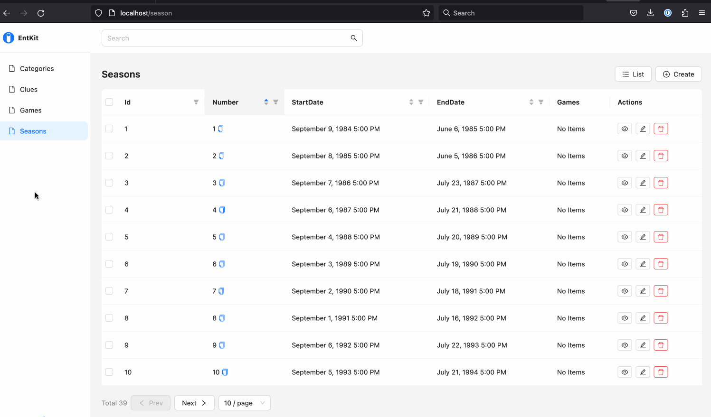

# jexplore

## [wip]


## reference
- https://github.com/entkit/entkit
- https://entkit.com/docs/get-started/introduction
- https://github.com/entkit/entkit-demo
- https://github.com/ent/ent
- https://github.com/ent/contrib
- https://atlasgo.io/getting-started/
- https://gqlgen.com/

## stuff

`./file.db`
- sqlite3 database

`./gen.go`
- `go generate` script to generate ent schema / gqlschema / webapp

`./ent/`
- https://entgo.io/docs/getting-started
- schema definition and generated ent schema

`./ent/schema/`
- where schema definitions actually live

`./ent/entc.go`
- ent codegen and plugin configuration

`./ent/migrate/`
- https://entgo.io/docs/versioned-migrations/
- migration files and data seeding

`./my-server/` + `./refine-app/`
- https://github.com/entkit/entkit
- gqlserver + react app, generated from ent schema
- some small tweaks made after generation to make it work
  - remove an auth type declaration from `my-server/main.go`
  - coerce record IDs from number to string in `refine-app/src/edges-diagram.tsx`
  - something else i'm forgetting...

## commands

create a new empty migration
```
atlas migrate new backfill-clues \
  --dir "file://ent/migrate/migrations"
```

update atlas.sum hash file after making changes to the empty migration
```
atlas migrate hash   
  --dir "file://ent/migrate/migrations"
```

apply migrations to the dev database
```
atlas migrate apply   
  --dir "file://ent/migrate/migrations"   
  --url "sqlite://file?mode=memory&_fk=1"
```

apply migrations to the file.db database
```
atlas migrate apply   
  --dir "file://ent/migrate/migrations"   
  --url "sqlite://file.db?_fk=1"
```

generate migration file from diff
```
atlas migrate diff some-migration-name \
  --dir "file://ent/migrate/migrations" \
  --to "ent://ent/schema" \
  --dev-url "sqlite://file?mode=memory&_fk=1"
```

run the generated server and web ui (in unified mode)
```
go run ./my-server/*.go serve -u refine-project
```